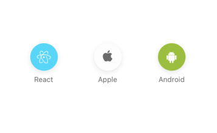
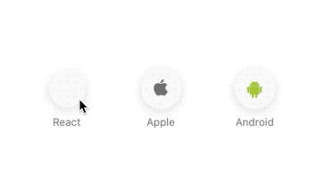

[](https://github.com/WrathChaos/@paraboly/react-native-switch-fab)

[](https://github.com/WrathChaos/@paraboly/react-native-switch-fab)

[](https://www.npmjs.com/package/@paraboly/react-native-switch-fab)
[](https://www.npmjs.com/package/@paraboly/react-native-switch-fab)

[](https://opensource.org/licenses/MIT)
[](https://github.com/prettier/prettier)

<p align="center">
  
  
</p>

# Installation

Add the dependency:

```ruby
npm i @paraboly/react-native-switch-fab
```

## Peer Dependencies

###### IMPORTANT! You need install them

```js
"react": ">= 16.x.x",
"react-native": ">= 0.55.x",
"react-native-androw": ">= 0.0.34",
"react-native-dynamic-vector-icons": ">= 0.2.1",
"react-native-material-ripple": ">= 0.9.1",
"react-native-vector-icons": ">= 6.6.0"
```

# Usage

## Import

```js
import SwitchFab from "@paraboly/react-native-switch-fab";
```

## Usage

### Basic Usage

```jsx
<SwitchFab />
```

### Advanced Usage

Check the example for the multiple & advanced usage

```jsx
<SwitchFab
  name="atom"
  type="Fontisto"
  rippleColor="transparent"
  activeBGColor="#00B1D2FF"
  inactiveBGColor="#FDDB27FF"
/>
```

# Configuration - Props

| Property          |      Type      |                    Default                    | Description                                                                                              |
| ----------------- | :------------: | :-------------------------------------------: | -------------------------------------------------------------------------------------------------------- |
| width             | string/number  |                      50                       | change the width of the button                                                                           |
| height            | string/number  |                      50                       | change the height of the button                                                                          |
| borderRadius      |     number     |                      25                       | change the border radius of the button                                                                   |
| IconComponent     | Icon Component | Icon (from react-native-dynamic-vector-icons) | set your own Icon component it can be your own MyIcon component or react-native-vector-icons or anything |
| isActive          |    boolean     |                     false                     | set the default active button                                                                            |
| onPress           |    function    |                   undefined                   | set your own logic for onPress it has callback for (isActive)                                            |
| animationDuration |     number     |                      750                      | change the animation duration for background color transition                                            |
| shadowColor       |     color      |                    #757575                    | change the button's shadow color                                                                         |
| activeBGColor     |     color      |                    #757575                    | change the button's active background color                                                              |
| inactiveBGColor   |     color      |                    #fdfdfd                    | change the button's inactive background color                                                            |
| activeIconColor   |     color      |                    #757575                    | change the button's active icon color                                                                    |
| inactiveIconColor |     color      |                    #fdfdfd                    | change the button's inactive icon color                                                                  |
| animationDuration |     number     |                      750                      | change the animation duration for background color transition                                            |
| animationDuration |     number     |                      750                      | change the animation duration for background color transition                                            |

## Future Plans

- [x] ~~LICENSE~~
- [ ] New Screenshot
- [ ] Write an article about the lib on Medium

## Author

FreakyCoder, kurayogun@gmail.com

## License

React Native SwitchFab by Paraboly is available under the MIT license. See the LICENSE file for more info.
